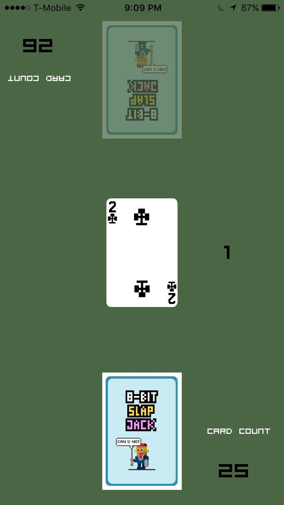

# 8Bit SlapJack(iOS)

####App specification:
This app is modeled after the game SlapJack. It is available on the AppStore. 
https://itunes.apple.com/us/app/8bit-slapjack/id1146084291?mt=8

####Gameplay:
Player one starts by swiping up a card from their pile into the middle of the table. Then, player two will swipe a card into the main pile. When a Jack shows up in the middle pile, then each player will want to swipe that card into their own pile. Whoever first swipes the card successfully will get to add that pile of cards into their hand. 

If a player incorrectly swipes the card in the middle pile, the penalty is that they need to burn a card from their hand into the main pile.

####Screenshots:

